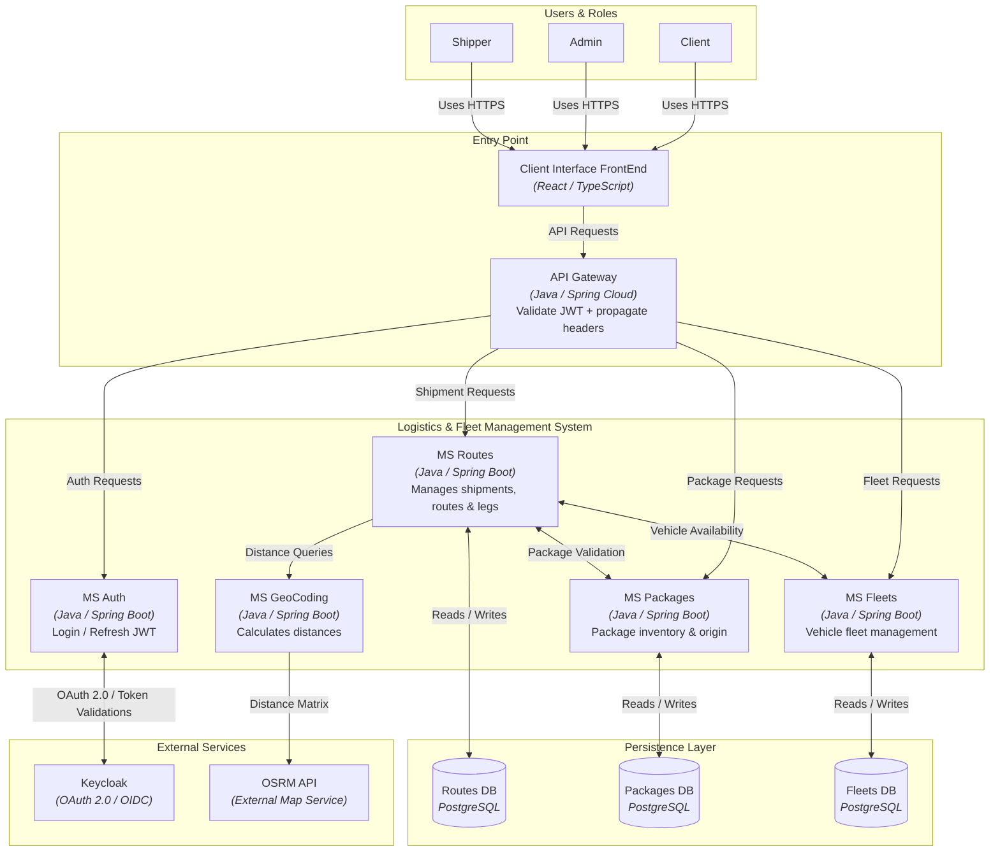
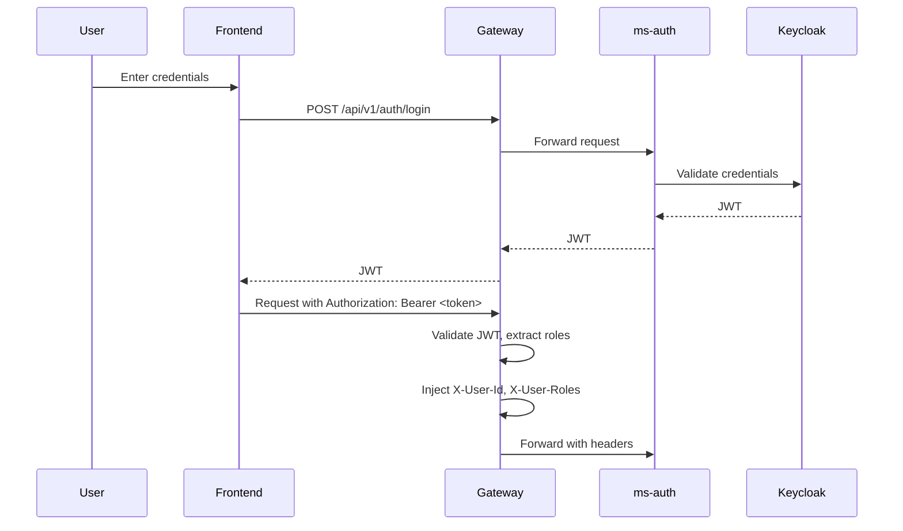

# Fleet Optimizer 2025

El objetivo general del proyecto es implementar una solución backend basada en microservicios para la gestión integral de un sistema de logística de transporte de paquetes. El sistema permite administrar una flota de vehículos, gestionar paquetes y planificar rutas de entrega de forma eficiente, optimizando costos y tiempos mediante el cálculo de distancias.

  

## Tecnologías Stack

|  | Tech Stack |
| :--- | :--- |
| **Backend** |    |
| **Frontend** |    |
| **Persistence & Data** |   |
| **Security & Auth** |     |
| **DevOps & Infra** |     |
| **Testing** |   |

<h2>Guía de inicio rápido</h2>

Seguí estos pasos para levantar el entorno de desarrollo completo.

<h3>Requisitos previos</h3>
<ul>
  <li>Docker y Docker Compose instalados.</li>
  <li>Git para clonar el repositorio.</li>
  <li>(Opcional) Java 17 y Maven para correr los servicios sin Docker.</li>
  <li>(Opcional) Node 20 y npm para correr el frontend sin Docker.</li>
</ul>

<h3>Paso a paso</h3>

<h4>1. Clonar el repositorio</h4>
<pre><code>git clone https://github.com/LucasCallamullo/fleet-optimizer.git
cd fleet-optimizer</code></pre>

<h4>2. Configurar las variables de entorno</h4>

El proyecto incluye un archivo de ejemplo. Creá tu propio archivo <code>.env</code> a partir de él y ajustá los valores si hace falta.

<pre><code>cp .env.example .env
# No hace falta editar el archivo .env creado, las claves de Keycloak son válidas.</code></pre>

<h4>3. 🐳 Levantar todos los servicios con Docker Compose</h4>

Desde la raíz del repositorio, ejecutá:

<pre><code>docker compose up -d --build</code></pre>

<strong>Esto descarga las imágenes base (PostgreSQL, nginx, node, Maven)</strong> y construye cada servicio del backend y el frontend. No hace falta compilar los JAR a mano: cada servicio tiene un Dockerfile multi-stage que compila el código dentro de la imagen.

<h4>4. Verificar que todo funcione</h4>
<ul>
  <li><strong>Frontend:</strong> <code>http://localhost</code></li>
  <li><strong>Gateway:</strong> <code>http://localhost:8080</code></li>
</ul>

El frontend lo sirve nginx en el puerto 80 y redirige las peticiones <code>/api</code> al Gateway. El Gateway es el único punto de entrada al backend; los microservicios y las bases de datos son internos y no están expuestos al host.

<h4>5. (Opcional) Detener los servicios</h4>
<pre><code>docker compose down</code></pre>

Para eliminar también los volúmenes de las bases de datos (esto borra todos los datos):

<pre><code>docker compose down -v</code></pre>

<h4>6. (Opcional) Correr el backend o el frontend sin Docker</h4>

Compilar los JAR a mano (solo si querés correr un servicio fuera de Docker)

<pre><code>cd backend
mvn clean package -DskipTests -f gateway/pom.xml
mvn clean package -DskipTests -f ms-auth/pom.xml
mvn clean package -DskipTests -f ms-fleets/pom.xml
mvn clean package -DskipTests -f ms-packages/pom.xml
mvn clean package -DskipTests -f ms-geocoding/pom.xml
mvn clean package -DskipTests -f ms-routes/pom.xml
</code></pre>

Si querés hot reload mientras desarrollás el frontend:

<strong>Frontend (dev server):</strong> <code>http://localhost:5173</code>
<pre><code>cd frontend
npm install
npm run dev</code></pre>

<h2>C4 Model</h2>

<h2>Database Schema (DER)</h2>

Cada microservicio posee su propia base de datos PostgreSQL. El siguiente diagrama muestra las tablas y las relaciones de ms-fleets, ms-routes y ms-packages.

  
Service responsibilities

<h2>Arquitectura General</h2>

El sistema sigue una arquitectura moderna compuesta por múltiples microservicios independientes, cada uno responsable de un dominio específico:

<h3>🔹 API Gateway</h3>

Punto de entrada único para todas las aplicaciones frontend o clientes externos. Encargado del enrutamiento y la comunicación hacia cada microservicio, además de validar los tokens JWT emitidos por Keycloak y propagar el contexto de usuario.

<h3>🔹 Servicio de Autenticación (ms-auth)</h3>

Centraliza la gestión de usuarios y la autenticación. Se integra con Keycloak (OAuth2/OpenID Connect) para la emisión y refresco de tokens JWT, y la gestión de roles y permisos.

<h3>🔹 Servicio de Flotas (ms-fleets)</h3>

Gestiona el catálogo de vehículos. Administra el CRUD de vehículos y sus categorías, incluyendo sus capacidades (peso y volumen máximo), costos operativos y estado de disponibilidad.

<h3>🔹 Servicio de Paquetes (ms-packages)</h3>

Administra el ciclo de vida de los paquetes, desde su creación (con peso, volumen y origen) hasta su estado final (CREADO, EN PROCESO, LISTO PARA RETIRAR, EN TRÁNSITO, ENTREGADO, etc.). Cada paquete está asociado a una tienda de origen.

<h3>🔹 Servicio de Rutas (ms-routes)</h3>

Orquesta el proceso de creación de envíos. Coordina la validación de paquetes y vehículos con otros microservicios, calcula distancias y tiempos a través del MS de Geocoding, y persiste las rutas y sus tramos (legs) de forma atómica. Cada paquete en un envío se convierte en un tramo de la ruta.

<h3>🔹 Frontend (React)</h3>

Aplicación cliente desarrollada en React que consume la API del Gateway. Proporciona una interfaz de usuario para la gestión de paquetes, vehículos, rutas y seguimiento de envíos. Se comunica exclusivamente con el API Gateway, que actúa como intermediario con el resto de los microservicios.

<h3>🔹 Servicio de Geocodificación (ms-geocoding)</h3>

Microservicio dedicado al cálculo de rutas y distancias en base a coordenadas geográficas (latitud/longitud). Consume la API de <strong>OpenRouteService (ORS)</strong>, un servicio de enrutamiento que requiere una clave de API para su uso. Soporta el cálculo de distancias y tiempos estimados para optimizar los costos y la logística del sistema. Implementa un endpoint batch para procesar múltiples ubicaciones en una sola llamada.

<h2>Flujo de Autenticación (OAuth2 + JWT)</h2>
<h3>Pasos del flujo:</h3>
<ol>
  <li>
    <strong>Inicio de Autenticación:</strong>
    El usuario inicia sesión desde el frontend con sus credenciales.
  </li>
  <li>
    <strong>Login en Gateway:</strong>
    El frontend envía las credenciales al endpoint <code>/api/v1/auth/login</code> del API Gateway.
  </li>
  <li>
    <strong>Validación en Keycloak:</strong>
    El Gateway enruta la petición al microservicio <code>ms-auth</code>, que valida las credenciales contra Keycloak y obtiene un token JWT.
  </li>
  <li>
    <strong>Token al Frontend:</strong>
    El Gateway devuelve el token JWT al frontend.
  </li>
  <li>
    <strong>Petición con Token:</strong>
    El frontend envía el token en el header <code>Authorization: Bearer &lt;token&gt;</code> en cada petición subsiguiente.
  </li>
  <li>
    <strong>Validación y Enrutamiento:</strong>
    El Gateway valida el token JWT (firma y expiración), extrae la información del usuario (ID, roles) del <code>realm_access</code> y la inyecta como headers (<code>X-User-Id</code>, <code>X-User-Roles</code>).
  </li>
  <li>
    <strong>Autorización en Microservicios:</strong>
    El microservicio destino recibe el contexto del usuario (a través de los headers) y utiliza <code>@PreAuthorize</code> para controlar el acceso a los endpoints según los roles.
  </li>
</ol>

<h2>🖥️ Capturas del Frontend</h2>

La aplicación ofrece una interfaz intuitiva para gestionar todos los aspectos del sistema logístico. A continuación, se muestran algunas de las pantallas principales.

<table>
  <tr>
    <td align="center">
      <strong>Dashboard</strong>
    </td>
    <td align="center">
      <strong>Gestión de Flota</strong>
    </td>
  </tr>
  <tr>
    <td align="center">
      
       
      <em>Dashboard con información del JWT y accesos rápidos</em>
    </td>
    <td align="center">
      
       
      <em>Tabla de vehículos con capacidades y estado</em>
    </td>
  </tr>

  <tr>
    <td align="center">
      <strong>Detalle de Paquete</strong>
    </td>
    <td align="center">
      <strong>Selección de Vehículo</strong>
    </td>
  </tr>
  <tr>
    <td align="center">
      
       
      <em>Detalle del paquete con selector de destino</em>
    </td>
    <td align="center">
      
       
      <em>Vehículos disponibles filtrados por capacidad</em>
    </td>
  </tr>

  <tr>
    <td align="center">
      <strong>C4 Model</strong>
    </td>

  </tr>
  <tr>
    <td align="center">
      
       
      <em>C4 con Draw.io Informal</em>
    </td>

  </tr>

</table>

<h2 id="contact"> 💻 Contacto Lucas Callamullo - Back-End Developer </h2>

|  |  |  |
|:-:|:-:|:-:|

|  |  |
|:-:|:-:|