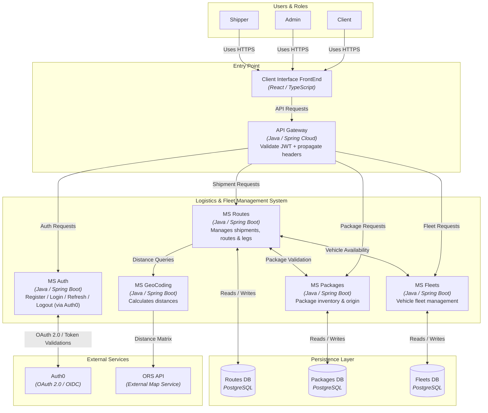
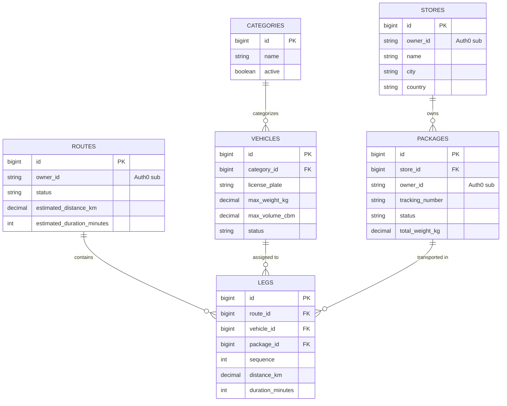
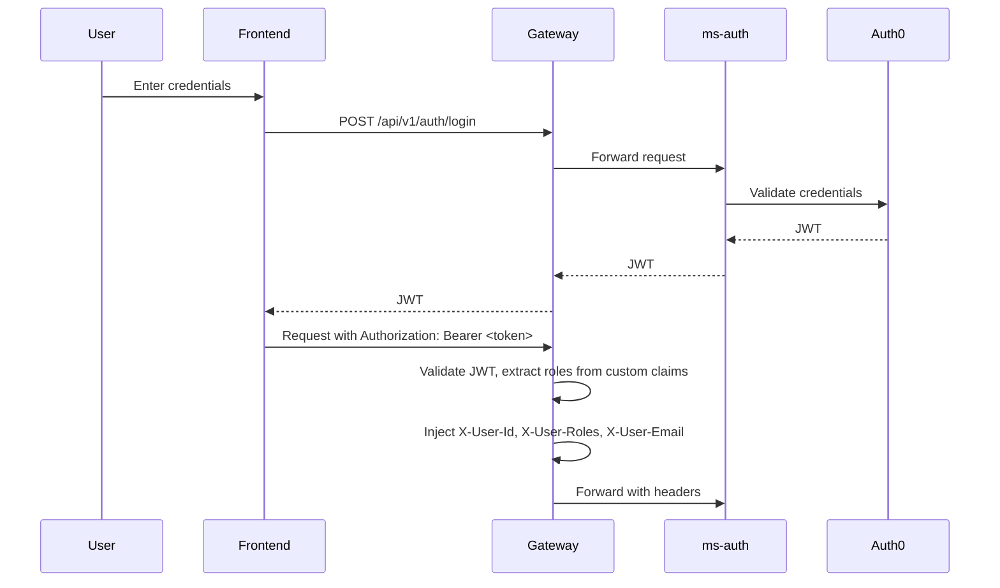
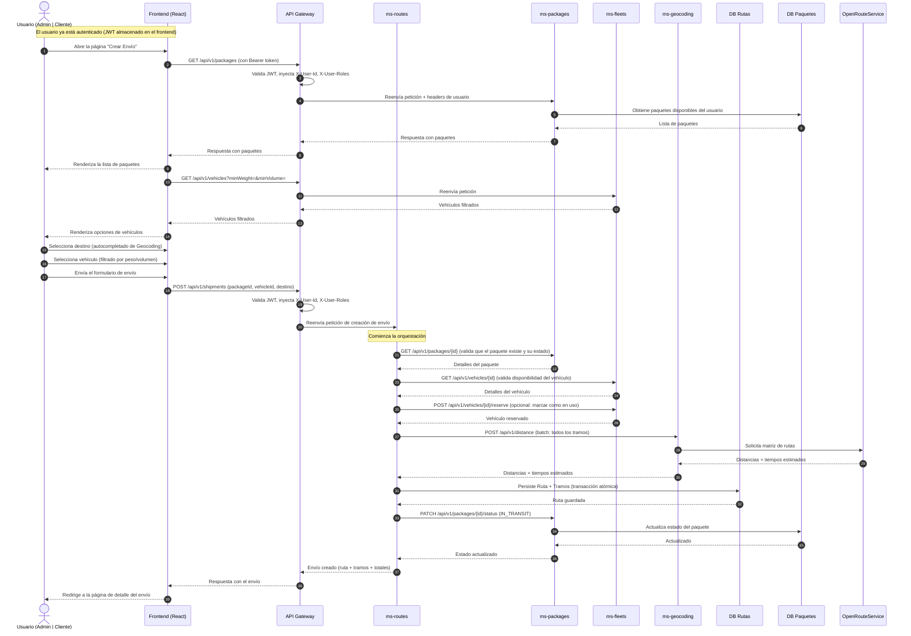

# Fleet Optimizer 2025

El objetivo general del proyecto es implementar una solución backend basada en microservicios para la gestión integral de un sistema de logística de transporte de paquetes. El sistema permite administrar una flota de vehículos, gestionar paquetes y planificar rutas de entrega de forma eficiente, optimizando costos y tiempos mediante el cálculo de distancias.

  

<h2>Índice</h2>
<ul>
  <li><a href="#technology-stack">Stack tecnológico</a></li>
  <li><a href="#quick-start-guide">Guía de inicio rápido</a></li>
  <li><a href="#c4-model">C4 Model</a></li>
  <li><a href="#database-schema-der">DER - Base de Datos</a></li>
  <li><a href="#authentication-flow">Flujo de autenticación</a></li>
  <li><a href="#shipment-creation-flow">Flujo de creación de envíos</a></li>
  <li><a href="#key-design-decisions">Decisiones de diseño</a></li>
  <li><a href="#contact">Contacto</a></li>
</ul>

<h2 id="technology-stack">Tecnologías Stack</h2>

|  | Tech Stack |
| :--- | :--- |
| **Backend** |    |
| **Frontend** |    |
| **Database** |   |
| **Security & Auth** |    |
| **DevOps & Infra** |     |
| **Testing** |   |
| **Docs** |  |

<h2 id="quick-start-guide">Guía de Inicio Rápido</h2>

Seguí estos pasos para configurar el entorno de desarrollo completo.

<h3>Requisitos previos</h3>
<ul>
  <li>Docker y Docker Compose instalados.</li>
  <li>Git para clonar el repositorio.</li>
  <li>(Opcional) Java 17 y Maven para correr los servicios sin Docker.</li>
  <li>(Opcional) Node 20 y npm para correr el frontend sin Docker.</li>
</ul>

<h3>Paso a paso</h3>

<h4>1. Clonar el repositorio</h4>
<pre><code>git clone https://github.com/LucasCallamullo/fleet-optimizer.git
cd fleet-optimizer</code></pre>

<h4>2. Configurar variables de entorno</h4>

El proyecto incluye un archivo de ejemplo. Creá tu propio archivo <code>.env</code> a partir de él y ajustá los valores si es necesario.

<pre><code>cp .env.example .env</code></pre>

<blockquote>
  <b>Nota:</b> El archivo <code>.env.example</code> usa placeholders. Para que funcione el flujo de autenticación,
  necesitás crear un tenant gratuito en Auth0 y configurarlo. La guía completa paso a paso
  está disponible en <a href="./docs/AUTH0_SETUP.md"><code>docs/AUTH0_SETUP.md</code></a>.
</blockquote>

<h4>3. 🐳 Levantar todos los servicios con Docker Compose</h4>

Desde la raíz del repositorio, ejecutá:

<pre><code>docker compose up -d --build</code></pre>

<strong>Esto descarga las imágenes base (PostgreSQL, nginx, node, Maven)</strong> y construye cada servicio del backend y el frontend. No hace falta compilar los JAR manualmente; cada servicio tiene un Dockerfile multi-stage que compila el código dentro de la imagen.

<h4>4. Verificar que todo funcione</h4>
<ul>
  <li>
    <strong>Frontend:</strong> <code>http://localhost</code>
    (servido por Nginx, redirige las peticiones <code>/api</code> al Gateway)
  </li>
  <li>
    <strong>Gateway (a través de Nginx):</strong> <code>http://localhost/api</code>
    (todas las llamadas a la API pasan por Nginx)
  </li>
</ul>

  Nginx actúa como único punto de entrada en el puerto 80. Todo el tráfico
  <code>/api</code> se redirige internamente al contenedor del Gateway. El Gateway
  <strong>no está expuesto al host</strong>; solo Nginx puede alcanzarlo.

  
Pasos opcionales

  <h4>(Opcional) Desarrollo / Debugging</h4>
  

    Por defecto, el Gateway solo es accesible a través de Nginx. Si querés
    pegarle a la API directamente (por ejemplo, con Postman o Swagger UI),
    descomentá temporalmente el bloque <code>ports</code> en <code>docker-compose.yml</code>:
  

  <pre><code>gateway-service:
    # ...
    ports:
      - "8080:8080"  # Descomentar solo para debugging local</code></pre>
  
Después reiniciá el stack y accedé a:

  <ul>
    <li>Gateway directo: <code>http://localhost:8080</code></li>
    <li>Swagger UI: <code>http://localhost:8080/swagger-ui.html</code></li>
  </ul>
  

    <strong>Nota:</strong> Cuando el Gateway está expuesto directamente, el navegador
    (o Postman) evita Nginx. Aplica la configuración de CORS del Gateway, y headers
    como <code>X-Forwarded-For</code> van a reflejar la dirección del Gateway en vez
    de la IP real del cliente. Esto está bien para debugging, pero
    <strong>nunca</strong> lo uses en producción.
  

  <h4>(Opcional) Correr el backend o el frontend sin Docker</h4>
  

    Igual necesitás las bases de datos corriendo. Podés levantar solo las bases
    de datos con Docker mientras corrés las apps de forma nativa:
  

  <pre><code>docker compose up -d postgres-fleets postgres-routes postgres-packages</code></pre>

  
Compilá los JARs manualmente (solo si querés correr un servicio fuera de Docker):

  <pre><code>cd backend
  mvn clean package -DskipTests -f gateway/pom.xml
  mvn clean package -DskipTests -f ms-auth/pom.xml
  mvn clean package -DskipTests -f ms-fleets/pom.xml
  mvn clean package -DskipTests -f ms-packages/pom.xml
  mvn clean package -DskipTests -f ms-geocoding/pom.xml
  mvn clean package -DskipTests -f ms-routes/pom.xml</code></pre>

  
Si querés hot reload mientras desarrollás el frontend:

  <strong>Frontend (servidor de desarrollo):</strong> <code>http://localhost:5173</code>
  <pre><code>cd frontend
  npm install
  npm run dev</code></pre>

  <h4>(Opcional) Detener los servicios</h4>
  <pre><code>docker compose down</code></pre>
  
Para eliminar también los volúmenes de las bases de datos (esto borra todos los datos):

  <pre><code>docker compose down -v</code></pre>

  
<h2 id="c4-model">C4 Model</h2>

  
<h2 id="database-schema-der">Database Schema (DER)</h2>

Cada microservicio posee su propia base de datos PostgreSQL. El siguiente diagrama muestra las tablas y las relaciones de ms-fleets, ms-routes y ms-packages.

<blockquote>
  
<strong>Notas:</strong>

  <ul>
    <li>
      No existe una tabla <code>users</code> local. La identidad del usuario la gestiona
      <strong>Auth0</strong>, y se referencia mediante el claim <code>sub</code>
      (ej: <code>auth0|6aaf...</code>) almacenado en las columnas <code>owner_id</code>.
    </li>
    <li>
      <code>owner_id</code> está <strong>desnormalizado</strong> en
      <code>stores</code>, <code>packages</code> y <code>routes</code> para evitar
      llamadas N+1 entre servicios al filtrar recursos por usuario.
    </li>
    <li>
      <code>legs.origin_*</code> y <code>legs.destination_*</code> almacenan una
      <strong>instantánea</strong> de la dirección al momento del envío, para que las
      rutas históricas sigan siendo precisas aunque la dirección de un local cambie después.
    </li>
  </ul>
</blockquote>

  
<h2 id="authentication-flow">Flujo de Autenticación (OAuth2 + JWT)</h2>
<h3>Pasos del flujo:</h3>
<ol>
  <li>
    <strong>Inicio de autenticación:</strong>
    El usuario inicia sesión desde el frontend con sus credenciales.
  </li>
  <li>
    <strong>Login en el Gateway:</strong>
    El frontend envía las credenciales al endpoint <code>/api/v1/auth/login</code> del API Gateway.
  </li>
  <li>
    <strong>Validación en Auth0:</strong>
    El Gateway redirige la petición al microservicio <code>ms-auth</code>, que valida las credenciales contra Auth0 y obtiene un token JWT.
  </li>
  <li>
    <strong>Token al frontend:</strong>
    El Gateway devuelve el token JWT al frontend.
  </li>
  <li>
    <strong>Petición con token:</strong>
    El frontend envía el token en el header <code>Authorization: Bearer &lt;token&gt;</code> en cada petición posterior.
  </li>
  <li>
    <strong>Validación y enrutamiento:</strong>
    El Gateway valida el token JWT (firma y expiración), extrae la información del usuario (ID, roles, email)
    de los claims personalizados del JWT (https://fo.dev/roles, https://fo.dev/email) y los inyecta como headers
    (<code>X-User-Id</code>, <code>X-User-Email</code>, <code>X-User-Roles</code>).
  </li>
  <li>
    <strong>Autorización en los microservicios:</strong>
    El microservicio destino recibe el contexto del usuario (vía headers) y usa <code>@PreAuthorize</code> para controlar el acceso a los endpoints según los roles.
  </li>
</ol>

  
<h2 id="shipment-creation-flow">Flujo de Creación de Envío (Orquestación Principal del Negocio)</h2>

  Este diagrama de secuencia ilustra el flujo principal del sistema: la creación de un envío.
  Muestra cómo <code>ms-routes</code> orquesta las llamadas de validación a otros microservicios
  (<code>ms-fleets</code>, <code>ms-packages</code>), calcula las distancias a través de
  <code>ms-geocoding</code>, y persiste la ruta y sus tramos de forma atómica.

  
<h2>🖥️ Capturas del Frontend</h2>

La aplicación ofrece una interfaz intuitiva para gestionar todos los aspectos del sistema logístico. A continuación, se muestran algunas de las pantallas principales.

<table>
  <tr>
    <td align="center">
      <strong>Dashboard</strong>
    </td>
    <td align="center">
      <strong>Gestión de Flota</strong>
    </td>
  </tr>
  <tr>
    <td align="center">
      
       
      <em>Dashboard con información del JWT y accesos rápidos</em>
    </td>
    <td align="center">
      
       
      <em>Tabla de vehículos con capacidades y estado</em>
    </td>
  </tr>

  <tr>
    <td align="center">
      <strong>Detalle de Paquete</strong>
    </td>
    <td align="center">
      <strong>Selección de Vehículo</strong>
    </td>
  </tr>
  <tr>
    <td align="center">
      
       
      <em>Detalle del paquete con selector de destino</em>
    </td>
    <td align="center">
      
       
      <em>Vehículos disponibles filtrados por capacidad</em>
    </td>
  </tr>

  <tr>
    <td align="center">
      <strong>C4 Model</strong>
    </td>
    <td align="center">
      <strong>DER</strong>
    </td>
  </tr>
  <tr>
    <td align="center">
      
       
      <em>graph services with Draw.io</em>
    </td>
    <td align="center">
      
       
      <em>DER with Draw.io</em>
    </td>
  </tr>
</table>

  
<h2 id="key-design-decisions">Decisiones Clave de Diseño</h2>
<ul>
  <li>
    <strong>Punto de entrada único a través del Gateway:</strong> solo el Gateway está expuesto al host.
    Todos los microservicios y bases de datos viven en una red interna de Docker.
    Esto reduce la superficie de ataque y centraliza las preocupaciones transversales (autenticación, logging, rate limiting).
  </li>
  <li>
    <strong>Base de datos por servicio:</strong> cada microservicio es dueño de su propia base de datos PostgreSQL.
    Sin esquema compartido, sin joins entre servicios. La comunicación es únicamente vía HTTP.
  </li>
  <li>
    <strong>Proveedor de Identidad gestionado (Auth0):</strong> en lugar de auto-hospedar Keycloak,
    el proyecto usa Auth0 para evitar la carga operativa de correr y parchear un IdP.
  </li>
  <li>
    <strong>Orquestación en ms-routes:</strong> el Servicio de Rutas actúa como orquestador
    para la creación de envíos, coordinando la validación con Paquetes y Flota antes de persistir.
  </li>
  <li>
    <strong>Nginx como reverse proxy:</strong> sirve el SPA compilado y redirige el tráfico
    <code>/api</code> al Gateway, manteniendo al navegador en un solo origen (sin problemas de CORS).
  </li>
</ul>

<blockquote>
  <b>Trabajo futuro:</b> rate limiting, observabilidad y CI/CD están en el roadmap
  y se irán agregando a medida que el proyecto evolucione.
</blockquote>

  

  
Responsabilidades de los servicios

  <h2>Arquitectura General</h2>

  
El sistema sigue una arquitectura moderna compuesta por múltiples microservicios independientes, cada uno responsable de un dominio específico:

  <h3>🔹 API Gateway</h3>
  
Punto de entrada único para todas las aplicaciones frontend o clientes externos. Responsable del enrutamiento y la comunicación hacia cada microservicio, así como de validar los tokens JWT emitidos por Auth0 y propagar el contexto del usuario.

  <h3>🔹 Servicio de Autenticación (ms-auth)</h3>
  
Centraliza la gestión de usuarios y la autenticación. Se integra con Auth0 (OAuth2/OpenID Connect) para la emisión y renovación de tokens JWT, y la gestión de roles y permisos.

  <h3>🔹 Servicio de Flota (ms-fleets)</h3>
  
Gestiona el catálogo de vehículos. Maneja operaciones CRUD para vehículos y sus categorías, incluyendo capacidades (peso y volumen máximos), costos operativos y estado de disponibilidad.

  <h3>🔹 Servicio de Paquetes (ms-packages)</h3>
  
Gestiona el ciclo de vida de los paquetes desde su creación (con peso, volumen y origen) hasta su estado final (CREATED, PROCESSING, READY_FOR_PICKUP, IN_TRANSIT, DELIVERED, etc.). Cada paquete está asociado a un local de origen.

  <h3>🔹 Servicio de Rutas (ms-routes)</h3>
  
Orquesta el proceso de creación de envíos. Coordina la validación de paquetes y vehículos con otros microservicios, calcula distancias y tiempos a través del MS de Geocoding, y persiste rutas y sus tramos de forma atómica. Cada paquete en un envío se convierte en un tramo de la ruta.

  <h3>🔹 Frontend (React)</h3>
  
Aplicación cliente desarrollada con React que consume la API del Gateway. Proporciona una interfaz de usuario para gestionar paquetes, vehículos, rutas y seguimiento de envíos. Se comunica exclusivamente con el API Gateway, que actúa como intermediario con el resto de los microservicios.

  <h3>🔹 Servicio de Geocoding (ms-geocoding)</h3>
  
Microservicio dedicado exclusivamente al cálculo de rutas y distancias basado en coordenadas geográficas (latitud/longitud). Consume la API de <strong>OpenRouteService (ORS)</strong>, un servicio de ruteo que requiere una API key para su uso. Soporta el cálculo de distancias y tiempos estimados para optimizar los costos y la logística del sistema. Implementa un endpoint batch para procesar múltiples ubicaciones en una sola llamada.

  

  <h2 id="contact">Contact</h2>
  <h3>Lucas Callamullo | Backend Software Engineer</h3>
  Specialized in Backend Development & Full Stack Web Solutions
    

  |  |  |  |  |  |
  |:-:|:-:|:-:|:-:|:-:|

