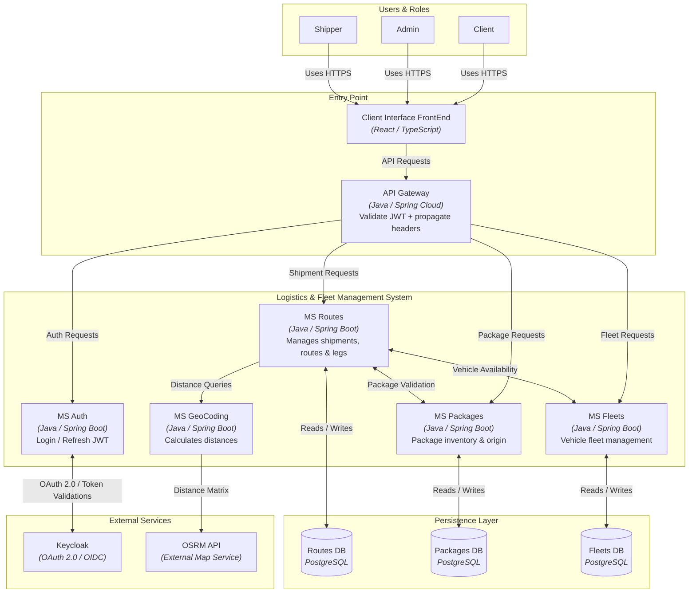
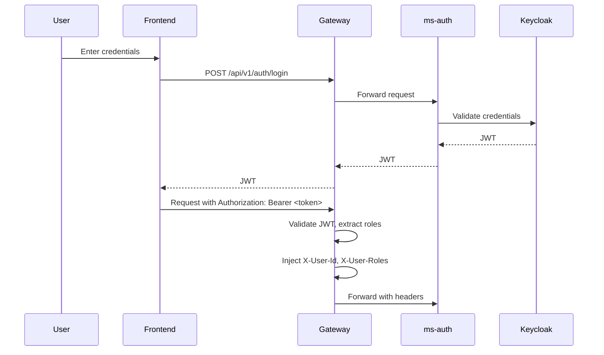

# Fleet Optimizer 2025

The overall objective of the project is to implement a microservices-based backend solution for the comprehensive management of a package transport logistics system. The system enables the management of a vehicle fleet, package handling, and efficient delivery route planning, optimizing costs and times through distance calculation.

  

## Technology Stack

|  | Tech Stack |
| :--- | :--- |
| **Backend** |    |
| **Frontend** |    |
| **Persistence & Data** |   |
| **Security & Auth** |     |
| **DevOps & Infra** |     |
| **Testing** |   |

<h2>Quick Start Guide</h2>

Follow these steps to set up the complete development environment.

<h3>Prerequisites</h3>
<ul>
  <li>Docker and Docker Compose installed.</li>
  <li>Git to clone the repository.</li>
  <li>(Optional) Java 17 and Maven to run services without Docker.</li>
  <li>(Optional) Node 20 and npm to run the frontend without Docker.</li>
</ul>

<h3>Step by Step</h3>

<h4>1. Clone the repository</h4>
<pre><code>git clone https://github.com/LucasCallamullo/fleet-optimizer.git
cd fleet-optimizer</code></pre>

<h4>2. Configure environment variables</h4>

The project includes an example file. Create your own <code>.env</code> file from it and adjust the values if needed.

<pre><code>cp .env.example .env
# No need to edit the created .env file, the Keycloak keys are valid.</code></pre>

<h4>3. 🐳 Start all services with Docker Compose</h4>

From the repository root, run:

<pre><code>docker compose up -d --build</code></pre>

<strong>This downloads the base images (PostgreSQL, nginx, node, Maven)</strong>  and builds every backend service and the frontend. No manual JAR build is required; each service has a multi-stage Dockerfile that compiles the code inside the image.

<h4>4. Verify everything is working</h4>
<ul>
  <li><strong>Frontend:</strong> <code>http://localhost</code></li>
  <li><strong>Gateway:</strong> <code>http://localhost:8080</code></li>
</ul>

The frontend is served by nginx on port 80 and proxies <code>/api</code> requests to the Gateway. The Gateway is the only backend entry point; microservices and databases are internal and not exposed to the host.

<h4>5. (Optional) Stop the services</h4>
<pre><code>docker compose down</code></pre>

To also remove the database volumes (this deletes all data):

<pre><code>docker compose down -v</code></pre>

<h4>6. (Optional) Run the backend or frontend without Docker</h4>

Build the JARs manually (only if you want to run a service outside Docker)

<pre><code>cd backend
mvn clean package -DskipTests -f gateway/pom.xml
mvn clean package -DskipTests -f ms-auth/pom.xml
mvn clean package -DskipTests -f ms-fleets/pom.xml
mvn clean package -DskipTests -f ms-packages/pom.xml
mvn clean package -DskipTests -f ms-geocoding/pom.xml
mvn clean package -DskipTests -f ms-routes/pom.xml
</code></pre>

If you want hot reload while developing the frontend:
<strong>Frontend (dev server):</strong> <code>http://localhost:5173</code>
<pre><code>cd frontend
npm install
npm run dev</code></pre>

<h2>C4 Model</h2>

<h2>Database Schema (DER)</h2>

Each microservice owns its own PostgreSQL database. The diagram below shows the tables and relationships for ms-fleets, ms-routes and ms-packages.

  
Service responsibilities

<h2>General Architecture</h2>

The system follows a modern architecture composed of multiple independent microservices, each responsible for a specific domain:

<h3>🔹 API Gateway</h3>

Single entry point for all frontend applications or external clients. Responsible for routing and communication to each microservice, as well as validating JWT tokens issued by Keycloak and propagating user context.

<h3>🔹 Authentication Service (ms-auth)</h3>

Centralizes user management and authentication. Integrates with Keycloak (OAuth2/OpenID Connect) for JWT token issuance and refresh, and role/permission management.

<h3>🔹 Fleet Service (ms-fleets)</h3>

Manages the vehicle catalog. Handles CRUD operations for vehicles and their categories, including capacities (maximum weight and volume), operational costs, and availability status.

<h3>🔹 Packages Service (ms-packages)</h3>

Manages the package lifecycle from creation (with weight, volume, and origin) to final status (CREATED, PROCESSING, READY_FOR_PICKUP, IN_TRANSIT, DELIVERED, etc.). Each package is associated with a source store.

<h3>🔹 Routes Service (ms-routes)</h3>

Orchestrates the shipment creation process. Coordinates package and vehicle validation with other microservices, calculates distances and times through the Geocoding MS, and atomically persists routes and their legs. Each package in a shipment becomes a leg of the route.

<h3>🔹 Frontend (React)</h3>

Client application developed with React that consumes the Gateway API. Provides a user interface for managing packages, vehicles, routes, and shipment tracking. Communicates exclusively with the API Gateway, which acts as an intermediary with the rest of the microservices.

<h3>🔹 Geocoding Service (ms-geocoding)</h3>

Microservice dedicated exclusively to route and distance calculation based on geographic coordinates (latitude/longitude). Consumes the <strong>OpenRouteService (ORS)</strong> API, a routing service that requires an API key for usage. Supports distance and estimated time calculation to optimize system costs and logistics. Implements a batch endpoint to process multiple locations in a single call.

<h2>Authentication Flow (OAuth2 + JWT)</h2>
<h3>Flow steps:</h3>
<ol>
  <li>
    <strong>Authentication Start:</strong>
    The user logs in from the frontend with their credentials.
  </li>
  <li>
    <strong>Login in Gateway:</strong>
    The frontend sends the credentials to the <code>/api/v1/auth/login</code> endpoint of the API Gateway.
  </li>
  <li>
    <strong>Validation in Keycloak:</strong>
    The Gateway routes the request to the <code>ms-auth</code> microservice, which validates the credentials against Keycloak and obtains a JWT token.
  </li>
  <li>
    <strong>Token to Frontend:</strong>
    The Gateway returns the JWT token to the frontend.
  </li>
  <li>
    <strong>Request with Token:</strong>
    The frontend sends the token in the <code>Authorization: Bearer &lt;token&gt;</code> header in every subsequent request.
  </li>
  <li>
    <strong>Validation and Routing:</strong>
    The Gateway validates the JWT token (signature and expiration), extracts user information (ID, roles) from <code>realm_access</code>, and injects it as headers (<code>X-User-Id</code>, <code>X-User-Roles</code>).
  </li>
  <li>
    <strong>Authorization in Microservices:</strong>
    The destination microservice receives the user context (via headers) and uses <code>@PreAuthorize</code> to control access to endpoints based on roles.
  </li>
</ol>

<h2>🖥️ Frontend Screenshots</h2>

The application provides an intuitive interface for managing all aspects of the logistics system. Below are some of the main screens.

<table>
  <tr>
    <td align="center">
      <strong>Dashboard</strong>
    </td>
    <td align="center">
      <strong>Fleet Management</strong>
    </td>
  </tr>
  <tr>
    <td align="center">
      
       
      <em>Dashboard with JWT info and quick access</em>
    </td>
    <td align="center">
      
       
      <em>Vehicles table with capacities and status</em>
    </td>
  </tr>

  <tr>
    <td align="center">
      <strong>Package Detail</strong>
    </td>
    <td align="center">
      <strong>Vehicle Selection</strong>
    </td>
  </tr>
  <tr>
    <td align="center">
      
       
      <em>Package details with destination selector</em>
    </td>
    <td align="center">
      
       
      <em>Available vehicles filtered by capacity</em>
    </td>
  </tr>

  <tr>
    <td align="center">
      <strong>graph services</strong>
    </td>

  </tr>
  <tr>
    <td align="center">
      
       
      <em>graph services with Draw.io</em>
    </td>

  </tr>
</table>

<h2 id="contact">Contact</h2>
<h3>Lucas Callamullo - Backend Developer</h3>

|  |  |  |
|:-:|:-:|:-:|

|  |  |
|:-:|:-:|
